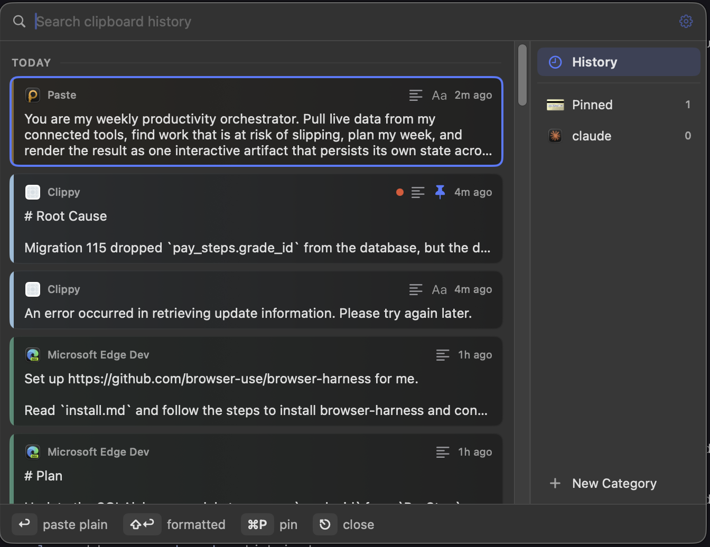
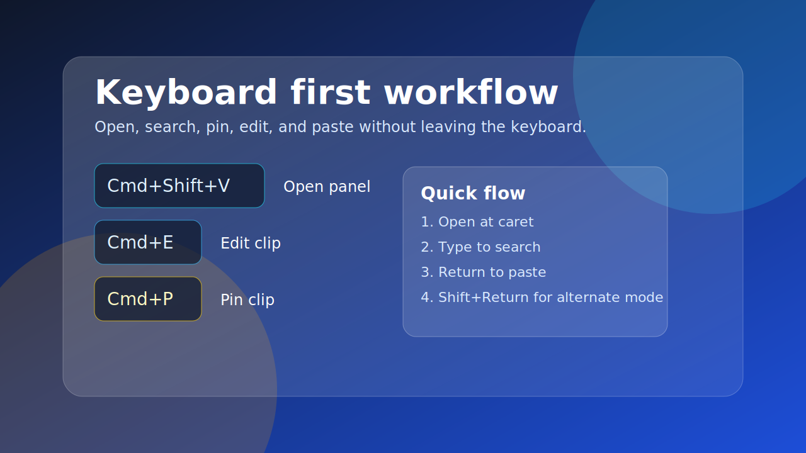
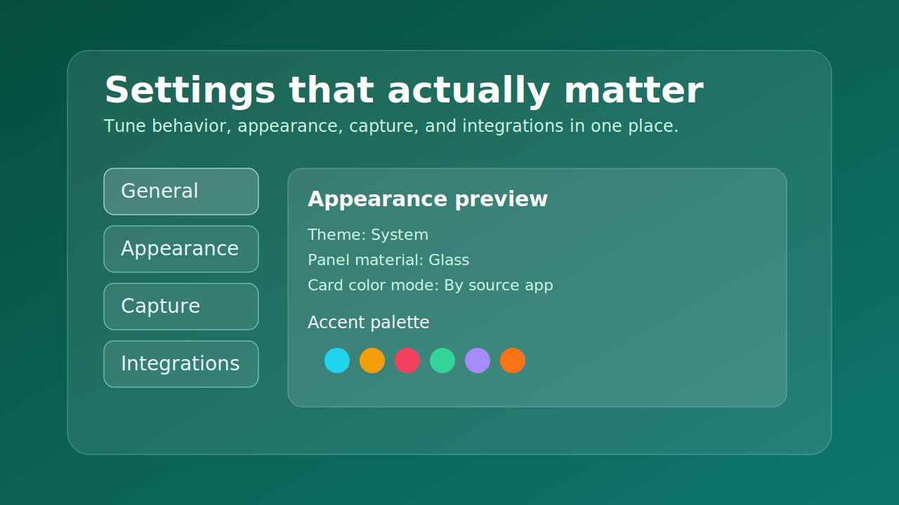
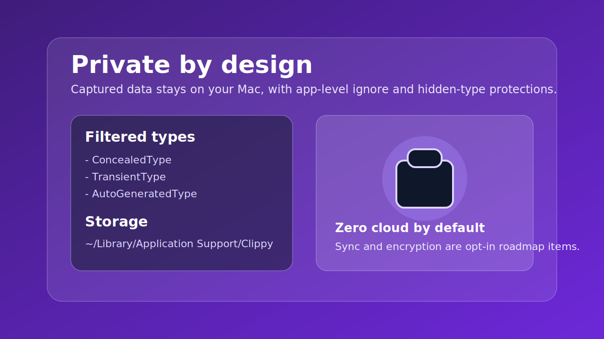
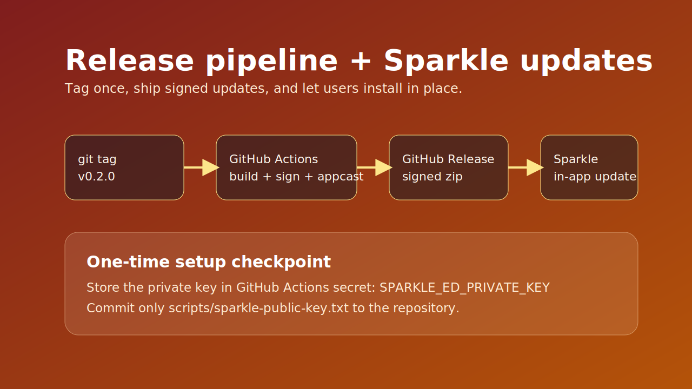

<div align="center" style="font-size: 2.5em; font-weight: bold; margin-bottom: 0.25em;">
Clippy
</div>

<div align="center">
  
</div>

#

A modern clipboard manager for power users who want more from their copy-paste workflow, without sacrificing privacy or performance.


## Visual Tour

| Main panel | Keyboard workflow |
| --- | --- |
|  |  |

| Settings overview | Privacy model |
| --- | --- |
|  |  |

| Release and update flow |
| --- |
|  |

## Feature Snapshot

| Area | Highlights |
| --- | --- |
|  | Popup appears at the caret, with mouse fallback in apps that hide caret location. |
|  | Fast prefix search with keyboard navigation and instant paste. |
|  | Source app icon tinting, type badges, and color swatches. |
|  | Pinned items float to the top and survive history caps and clear actions. |
|  | Sparkle checks appcast and installs signed updates in place. |
|  | Clipboard data stays on your machine by default. |

Built per `clipboard-manager-stack-decision.md`: Swift, SwiftUI inside a nonactivating `NSPanel`, Accessibility API for caret positioning, GRDB/SQLite with FTS5 search.

## Build and Run

Requires macOS 14+, Swift 6 (Xcode 16+ or current Command Line Tools).

```sh
./scripts/make-app.sh
open build/Clippy.app
```

For development:

```sh
swift build && .build/debug/Clippy
```

Use the `.app` bundle for daily usage so the bundle id keeps Accessibility permission stable across rebuilds.

On first launch, grant Accessibility in System Settings > Privacy & Security > Accessibility. It is required to read caret position and send Cmd-V for in-place paste.

## Keyboard Map

| Action | Shortcut |
| --- | --- |
| Open panel | Cmd+Shift+V |
| History tab | Cmd+1 |
| Pinned tab | Cmd+2 |
| Paste selected clip | Return |
| Paste alternate mode | Shift+Return |
| Edit selected clip | Cmd+E |
| Pin selected clip | Cmd+P |
| Delete selected clip | Cmd+Delete |
| Close panel | Esc |

## Settings

| Tab | Controls |
| --- | --- |
| General | Paste defaults, move-to-top, history cap, launch at login |
| Appearance | Theme, accent colors, panel material, card color mode, app icons, date headers, popup position, panel size |
| Capture | Polling interval (100-1000 ms), per-app ignore list |
| Integrations | Export history as JSON, reveal DB in Finder, planned MCP server, REST API, sync, encryption |

## Releases and Auto-Update

Tagging a release like `v0.2.0` runs `.github/workflows/release.yml`: tests, app build at tag version, EdDSA-signed zip, GitHub Release publish, and refreshed `appcast.xml` on main.

Release ritual:

```sh
git tag v0.2.0
git push origin v0.2.0
```

One-time setup before first release (private key must never enter the repo):

```sh
# 1) Get Sparkle key tools
curl -L -o /tmp/sparkle.tar.xz \
  https://github.com/sparkle-project/Sparkle/releases/download/2.9.3/Sparkle-2.9.3.tar.xz
mkdir -p /tmp/sparkle-dist && tar -xf /tmp/sparkle.tar.xz -C /tmp/sparkle-dist

# 2) Generate keypair (private key goes to login Keychain)
/tmp/sparkle-dist/bin/generate_keys

# 3) Commit printed public key
echo "<public key from step 2>" > scripts/sparkle-public-key.txt

# 4) Export private key once and add as GitHub Actions secret:
#    SPARKLE_ED_PRIVATE_KEY
/tmp/sparkle-dist/bin/generate_keys -x /tmp/sparkle-private-key
cat /tmp/sparkle-private-key | pbcopy && rm /tmp/sparkle-private-key
```

Local builds without a real public key skip updater wiring. `scripts/make-app.sh 1.2.3` injects a version explicitly.

## Debug Flags

- `--show-panel` opens the popup right after launch.
- `--screenshot [path]` renders the popup to a PNG and exits (used for UI smoke tests).

## Privacy and Capture Rules

- `org.nspasteboard.ConcealedType`, `TransientType`, and `AutoGeneratedType` are never stored.
- Apps on the ignore list are never captured.
- Data stays local at `~/Library/Application Support/Clippy/clippy.sqlite`.
- Encryption at rest (SQLCipher) is the next milestone.

## Layout

```text
Sources/Clippy/
  main.swift                     app entry, accessory activation policy
  AppDelegate.swift              wiring: status item, hotkey, services
  Capture/ClipboardMonitor.swift NSPasteboard changeCount polling + filters
  Storage/Clip.swift             record model
  Storage/ClipDatabase.swift     GRDB queue, migrations, FTS5, queries
  Positioning/CaretLocator.swift AX caret rect + coordinate conversion
  Panel/PastePanel.swift         nonactivating borderless key-capable panel
  Panel/PanelController.swift    placement modes, clamping, show/hide
  Panel/EditorWindowController.swift
  Paste/PasteService.swift       pasteboard write + simulated Cmd-V
  Support/HotKeyCenter.swift     Carbon global hotkey
  Support/AppSettings.swift      user-facing settings, UserDefaults-backed
  UI/                            SwiftUI views (list, editor, settings)
```

## Roadmap

1. Pinboards (named collections)
2. SQLCipher encryption at rest, key in the Keychain
3. MCP server (official Swift SDK) + loopback REST API
4. User-controlled sync (synced folder / CloudKit / encrypted export)
5. Custom hotkey recording
