# F1 — Capture Pipeline

Poll `NSPasteboard` -> change-count dedup -> text/image split -> persist -> eviction cap -> sound -> `.clippyDidCapture`.

Key correction from trace: capture classification does NOT use `ClipKind.detect`. The capture branch decides text vs image purely by `pasteboard.string` presence ([ClipboardMonitor.swift:89](Sources/Clippy/Capture/ClipboardMonitor.swift:89)). `ClipKind.detect` runs later at render time ([ClipKind.swift:115](Sources/Clippy/Storage/ClipKind.swift:115)).

Notification ordering: `playCaptureSound` posts `.clippyDidCapture` BEFORE checking `captureSoundEnabled` ([ClipboardMonitor.swift:170-171](Sources/Clippy/Capture/ClipboardMonitor.swift:170)), so the icon bounce fires even when sound is off.

```mermaid
flowchart TD
    start["monitor.start()<br/>AppDelegate.swift:28"] --> sched["scheduleTimer()<br/>ClipboardMonitor.swift:54"]
    sched --> tick["tick()<br/>ClipboardMonitor.swift:65"]
    tick --> cc{"changeCount != lastChangeCount?<br/>ClipboardMonitor.swift:67"}
    cc -->|no| tick
    cc -->|yes| skip{"skipNextChange / isPaused?<br/>ClipboardMonitor.swift:69-73"}
    skip -->|skip| tick
    skip -->|proceed| capture["captureCurrentPasteboard()<br/>ClipboardMonitor.swift:79"]
    capture --> filt{"types empty / concealed / ignored app?<br/>ClipboardMonitor.swift:80-87"}
    filt -->|reject| tick
    filt -->|ok| classify{"pasteboard.string non-empty?<br/>ClipboardMonitor.swift:89"}

    classify -->|text| captureText["captureText()<br/>ClipboardMonitor.swift:97"]
    captureText --> buildText["build Clip (text)<br/>ClipboardMonitor.swift:109"]
    buildText --> saveText["saveCapturedClip()<br/>ClipDatabase.swift:145"]
    saveText --> dedupT{"existing contentText row?<br/>ClipDatabase.swift:149"}
    dedupT -->|yes| bumpT["update timestamp/source<br/>ClipDatabase.swift:154-157"]
    dedupT -->|no| insertT["insert row<br/>ClipDatabase.swift:161"]
    insertT --> evictT["evictOverCap()<br/>ClipDatabase.swift:195"]
    bumpT --> snd
    evictT --> delFilesT["media.delete(evicted)<br/>MediaStore.swift:60"]
    delFilesT --> snd

    classify -->|no text| captureImg["captureImageIfPresent()<br/>ClipboardMonitor.swift:133"]
    captureImg --> imgGate{"captureImages + pngData + size cap?<br/>ClipboardMonitor.swift:134-137"}
    imgGate -->|reject| tick
    imgGate -->|ok| pngData["pngData() png-or-tiff decode<br/>ClipboardMonitor.swift:175"]
    pngData --> mstore["media.store(pngData)<br/>MediaStore.swift:36"]
    mstore --> writeFiles["write PNG + thumb JPEG<br/>MediaStore.swift:46-49"]
    writeFiles --> buildImg["build Clip (image)<br/>ClipboardMonitor.swift:141"]
    buildImg --> saveImg["saveCapturedImageClip()<br/>ClipDatabase.swift:170"]
    saveImg --> dedupI{"existing mediaFilename row?<br/>ClipDatabase.swift:174"}
    dedupI -->|yes| bumpI["update timestamp/source<br/>ClipDatabase.swift:178-181"]
    dedupI -->|no| insertI["insert row<br/>ClipDatabase.swift:185"]
    insertI --> evictI["evictOverCap()<br/>ClipDatabase.swift:195"]
    bumpI --> snd
    evictI --> delFilesI["media.delete(evicted)<br/>MediaStore.swift:60"]
    delFilesI --> snd

    snd["playCaptureSound()<br/>ClipboardMonitor.swift:166"] --> notif["post .clippyDidCapture<br/>ClipboardMonitor.swift:170"]
    snd --> soundGate{"captureSoundEnabled?<br/>ClipboardMonitor.swift:171"}
    soundGate -->|yes| play["SoundPlayer.play(id:volume:)<br/>SoundCatalog.swift:133"]
    notif --> bounce["StatusBarIcon.bounce (observer)<br/>AppDelegate.swift:96-102"]
```

External deps: `AppSettings.shared` (polling/ignored/images/cap/sound), `StatusBarIcon.bounce`, GRDB, AppKit/CryptoKit/CoreGraphics, `MediaStore.sweepOrphans` (launch-time, not per-capture).

Side effects: DB writes (save/evict), file I/O (MediaStore 2 files written, evicted files deleted), async sound, `.clippyDidCapture` post.
