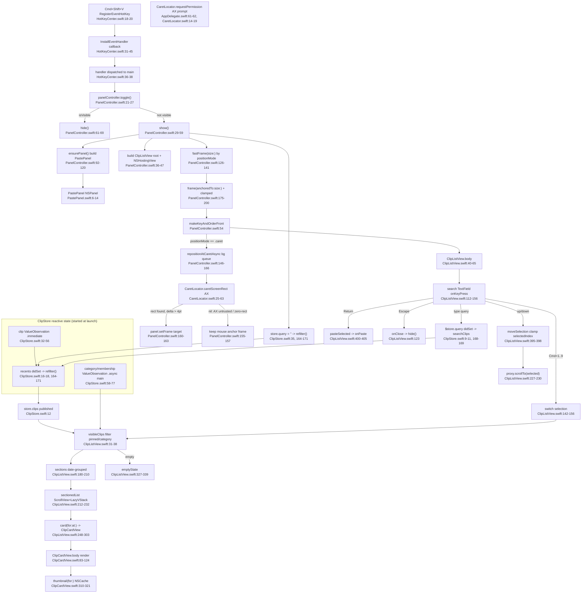

# F2 — Display / Present Pipeline

Hotkey -> `PanelController.show` -> position (caret/mouse/center) -> reactive `ClipStore` -> `ClipListView` date-sectioned `ClipCardView` list -> keyboard nav.

`ClipStore.init` starts two GRDB `ValueObservation`s before the panel ever opens: clip window (`.immediate`, [ClipStore.swift:32-56](Sources/Clippy/UI/ClipStore.swift:32)) and categories/membership (`.async(onQueue:.main)`, [ClipStore.swift:58-77](Sources/Clippy/UI/ClipStore.swift:58)). `windowDidResignKey` deliberately no-ops ([PanelController.swift:85](Sources/Clippy/Panel/PanelController.swift:85)) — focus loss does NOT close the panel.

External deps: Carbon hotkey, ApplicationServices AX (CaretLocator), AppKit panel/screen/cache, SwiftUI/Combine, GRDB ValueObservation + `searchClips` (FTS5). Consumes `AppSettings`, `Theme`/`ThemeTokens`, `CategorySidePane` (F4), `Theme` tokens (F5).
