# F3 — Paste-back & Edit

Two paths off the panel callbacks `onPaste`/`onEdit` ([PanelController.swift:11-12](Sources/Clippy/Panel/PanelController.swift:11), wired [AppDelegate.swift:42-54](Sources/Clippy/AppDelegate.swift:42)).

Notable: an edit converts a rich clip to plain text — `updateClipText` nulls `contentRTF`/`contentHTML` and forces `typeIdentifier = 'public.utf8-plain-text'` ([ClipDatabase.swift:224-234](Sources/Clippy/Storage/ClipDatabase.swift:224)). No empty-text guard in the editor; `clip.id == nil` short-circuits before any DB call.

```mermaid
flowchart TD
    subgraph PasteBack["(a) Paste-back flow"]
        A["User selects clip (tap/menu/button)<br/>ClipListView.swift:272,404,275-277,264-265"] --> B["compute asPlainText (default XOR shift)<br/>ClipListView.swift:403"]
        B --> C["onPaste(clip, asPlainText)<br/>ClipListView.swift:404 -> PanelController.swift:11,38"]
        C --> D["AppDelegate onPaste closure<br/>AppDelegate.swift:42-46"]
        D --> E["panelController.hide()<br/>AppDelegate.swift:44"]
        E --> F["PasteService.paste(clip, asPlainText:)<br/>PasteService.swift:16"]
        F --> G{"movePastedItemToTop?<br/>PasteService.swift:19"}
        G -- "false (default)" --> H["monitor.ignoreNextChange()<br/>ClipboardMonitor.swift:50-52"]
        G -- "true" --> I["skip suppression (clip re-captured)<br/>AppSettings.swift:93-94"]
        H --> J["pasteboard.clearContents()<br/>PasteService.swift:24"]
        I --> J
        J --> K{"contentKind?<br/>PasteService.swift:25"}
        K -- image --> L["setData PNG + TIFF<br/>PasteService.swift:27-34"]
        K -- text --> M{"asPlainText?<br/>PasteService.swift:37"}
        M -- "false" --> N["setData RTF + HTML<br/>PasteService.swift:38-43"]
        M -- "true" --> O["skip rich types<br/>PasteService.swift:37"]
        N --> P["setString plain text<br/>PasteService.swift:47"]
        O --> P
        L --> Q["asyncAfter +0.12s<br/>PasteService.swift:51"]
        P --> Q
        Q --> R["sendPasteKeystroke()<br/>PasteService.swift:56"]
        R --> S{"AXIsProcessTrusted?<br/>PasteService.swift:57"}
        S -- "no" --> T["return; manual paste only<br/>PasteService.swift:57"]
        S -- "yes" --> U["post Cmd-V to cghidEventTap<br/>PasteService.swift:60-67"]
    end

    subgraph EditFlow["(b) Edit flow"]
        AA["User selects Edit<br/>ClipListView.swift:129,279,266"] --> BB["onEdit(clip)<br/>ClipListView.swift:266 -> PanelController.swift:12,39"]
        BB --> CC["AppDelegate onEdit closure (panel stays open)<br/>AppDelegate.swift:47-54"]
        CC --> DD["EditorWindowController.open(clip:onSave:)<br/>EditorWindowController.swift:9"]
        DD --> EE["build ClipEditorView(initialText:)<br/>EditorWindowController.swift:10-19"]
        EE --> FF["NSWindow + NSApp.activate + makeKeyAndOrderFront<br/>EditorWindowController.swift:21-34"]
        FF --> GG{"Save or Cancel?<br/>ClipEditorView.swift:23-26"}
        GG -- Cancel --> HH["onCancel -> close()<br/>EditorWindowController.swift:16-18,37-40"]
        GG -- Save --> II["onSave(text) then close()<br/>EditorWindowController.swift:12-15"]
        II --> JJ["ClipStore.updateText(of:to:)<br/>ClipStore.swift:145-148"]
        JJ --> KK{"clip.id != nil?<br/>ClipStore.swift:146"}
        KK -- "nil" --> LL["return, no DB write<br/>ClipStore.swift:146"]
        KK -- "id" --> MM["database.updateClipText(id:newText:)<br/>ClipDatabase.swift:223"]
        MM --> NN["UPDATE clips: set text, NULL rich, force plain type<br/>ClipDatabase.swift:224-234"]
    end
```

External deps: AppKit `NSPasteboard`/`NSWindow`/`NSApp`, ApplicationServices `AXIsProcessTrusted`, Carbon `kVK_ANSI_V`, CoreGraphics `CGEvent` (`.cghidEventTap`), GRDB, SwiftUI.

Side effects: pasteboard write, synthetic Cmd-V keystroke, re-capture suppression flag, editor window open + app activation, DB update.
