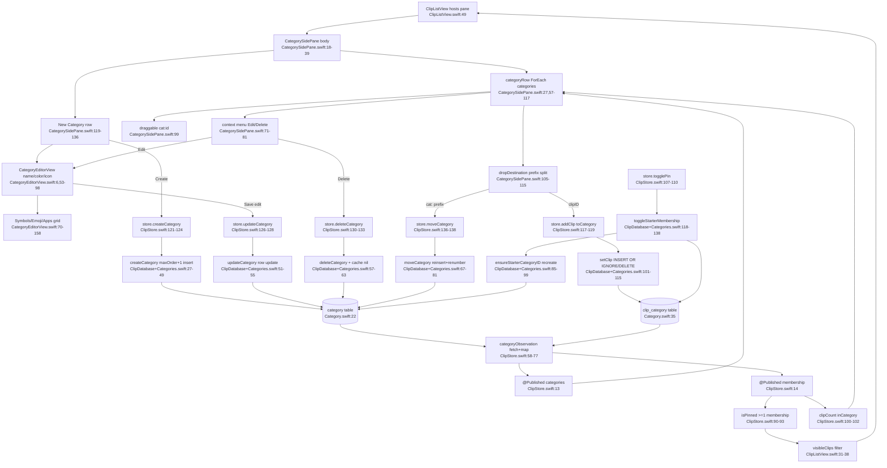

# F4 — Categories / Pinboards

Tag model: a clip is "pinned" iff it belongs to >= 1 category. "Pinned" is NOT a stored flag on a clip; it is derived from `clip_category` junction membership ([ClipStore.isPinned:90-93](Sources/Clippy/UI/ClipStore.swift:90)). The starter category literally named "Pinned" is just one category among many; Cmd+P toggles membership in it via `toggleStarterMembership` ([ClipDatabase+Categories.swift:118](Sources/Clippy/Storage/ClipDatabase+Categories.swift:118)), which auto-recreates it if deleted ([:85-99](Sources/Clippy/Storage/ClipDatabase+Categories.swift:85)).

Reorder persistence is per-row `update(db)` inside one write transaction, not a bulk statement ([:75-78](Sources/Clippy/Storage/ClipDatabase+Categories.swift:75)). All store actions swallow errors with `try?`.

External deps: GRDB (ValueObservation, raw SQL), Combine, SwiftUI drag/drop/popover, `AppIconProvider`, `CategoryPalette`, `Color(hexString:)`, `ThemeTokens`.

Gap: migration v2 schema for `category`/`clip_category` (and any `ON DELETE CASCADE`) is referenced ([:19-20](Sources/Clippy/Storage/ClipDatabase+Categories.swift:19)) but defined in `ClipDatabase.makeMigrator`, not read in full.
