# F5 — Settings & Theming

Single source of state: `AppSettings.shared` ([AppSettings.swift:25](Sources/Clippy/Support/AppSettings.swift:25)), a UserDefaults-backed `ObservableObject` where every `@Published` `didSet` writes straight to UserDefaults. Theme funnel: `AppSettings.theme` (computed, [:195](Sources/Clippy/Support/AppSettings.swift:195)) -> `Theme.tokens(self)` ([ThemePreset.swift:147](Sources/Clippy/Support/ThemePreset.swift:147)) branching `.system`/`.custom`/fixed-preset, with accent override on top.

Propagation: a control mutates an `@Published` var -> (1) `didSet` persists, (2) `objectWillChange` publishes -> any view holding `@ObservedObject AppSettings.shared` re-evaluates `body`; `tokens` is computed so colors/typography repaint live. Caveat: the panel window's `NSAppearance` is set only inside `PanelController.show()` ([:46](Sources/Clippy/Panel/PanelController.swift:46)), so an already-open panel's AppKit chrome (scrollbars/caret) only restamps on next show.

Launch-at-login bypasses UserDefaults entirely — local `@State` seeded from `SMAppService.mainApp.status`, mutates the system login-item registry ([SettingsView.swift:102-114](Sources/Clippy/UI/SettingsView.swift:102)). `maxHistoryItems` is read at capture time as the eviction cap.

```mermaid
flowchart TD
    subgraph entry [Entry]
        OpenSettings["AppDelegate.openSettings()<br/>AppDelegate.swift:156"]
        SettingsView["SettingsView TabView<br/>SettingsView.swift:6"]
    end
    subgraph store [State + Persistence]
        Shared["AppSettings.shared (ObservableObject)<br/>AppSettings.swift:25"]
        DidSet["@Published didSet -> UserDefaults.set<br/>AppSettings.swift:75-192"]
        InitHydrate["init register + hydrate defaults<br/>AppSettings.swift:256-344"]
    end
    subgraph tabs [Tabs edit values]
        GeneralTab["GeneralSettingsTab<br/>SettingsView.swift:43"]
        AppearanceTab["AppearanceSettingsTab<br/>SettingsView.swift:119"]
        CaptureTab["CaptureSettingsTab<br/>SettingsView.swift:352"]
        IntegrationsTab["IntegrationsSettingsTab<br/>SettingsView.swift:476"]
    end
    subgraph resolve [Theme resolution]
        ThemeComputed["AppSettings.theme (computed)<br/>AppSettings.swift:195"]
        Tokens["Theme.tokens(settings)<br/>ThemePreset.swift:147"]
        FixedTokens["ThemePreset.fixedTokens<br/>ThemePreset.swift:69"]
        SystemTokens["Theme.systemTokens<br/>ThemePreset.swift:202"]
        CustomTokens["Theme.customTokens<br/>ThemePreset.swift:181"]
        NSAppear["Theme.nsAppearance<br/>ThemePreset.swift:168"]
        ThemeTokensStruct["ThemeTokens struct<br/>ThemePreset.swift:14"]
        Typography["PanelTypography body/title/metadata<br/>Theme.swift:215"]
        AccentEnum["AccentTheme.color<br/>Theme.swift:66"]
    end
    subgraph render [Rendered UI]
        PanelShow["PanelController.show()<br/>PanelController.swift:29"]
        PanelAppear["panel.appearance = Theme.nsAppearance<br/>PanelController.swift:46"]
        ClipList["ClipListView tokens = settings.theme<br/>ClipListView.swift:25"]
        ThemedBG["ThemedPanelBackground (opacity/blur)<br/>ThemedBackground.swift:30"]
        Card["ClipCardView cardColor/cardStyle<br/>ClipCardView.swift:66"]
        SettingsThemed["SettingsView .tint + WindowAppearanceApplier<br/>SettingsView.swift:21"]
    end
    subgraph custom [Custom-mode branches]
        CustomRow["customColorRow hex<->ColorPicker<br/>SettingsView.swift:307"]
        Seed["seedCustomFromActive()<br/>AppSettings.swift:216"]
        Reset["resetCustomColors()<br/>AppSettings.swift:198"]
        HexParse["NSColor(themeHex:)<br/>ThemePreset.swift:245"]
    end
    subgraph effects [Side effects]
        Launch["updateLaunchAtLogin SMAppService<br/>SettingsView.swift:102"]
        Save["saveCapturedClip cap=maxHistoryItems<br/>ClipDatabase.swift:145"]
        Evict["evictOverCap(db, cap)<br/>ClipDatabase.swift:195"]
    end

    OpenSettings --> SettingsView
    SettingsView --> GeneralTab & AppearanceTab & CaptureTab & IntegrationsTab
    SettingsView --> Shared
    InitHydrate --> Shared
    GeneralTab -->|maxHistoryItems, paste flags| Shared
    AppearanceTab -->|themePreset, appearanceMode, accent, opacity, card*, font*| Shared
    CaptureTab -->|polling, images, sounds, ignored| Shared
    GeneralTab -->|toggle| Launch
    Shared --> DidSet
    Shared -->|objectWillChange publish| ClipList
    Shared -->|objectWillChange publish| SettingsThemed
    AppearanceTab -->|themePreset == .custom| CustomRow
    CustomRow --> HexParse
    CustomRow --> Shared
    Seed --> Shared
    Reset --> Shared
    Shared --> ThemeComputed --> Tokens
    Tokens --> FixedTokens & SystemTokens & CustomTokens
    CustomTokens --> HexParse
    Tokens --> ThemeTokensStruct
    AccentEnum --> Tokens
    Shared --> NSAppear
    ThemeTokensStruct --> ClipList
    ThemeTokensStruct --> Card
    Typography --> ClipList
    Typography --> Card
    PanelShow --> PanelAppear
    NSAppear --> PanelAppear
    PanelShow --> ClipList
    ClipList --> ThemedBG
    ClipList --> Card
    SettingsThemed --> NSAppear
    Shared -->|maxHistoryItems read at capture| Save --> Evict
```

External deps: ServiceManagement (`SMAppService`), AppKit (`NSAppearance`/`NSColor`/`NSFontManager`/`NSVisualEffectView`), SwiftUI, Foundation `UserDefaults`, GRDB (eviction sink), `AppIconProvider.dominantColor` + `ClipKind.tint` (card color sourcing).

Structure note: appearance enums live in `Theme.swift`; `ThemeTokens`/`ThemePreset`/resolver live in `ThemePreset.swift`.
