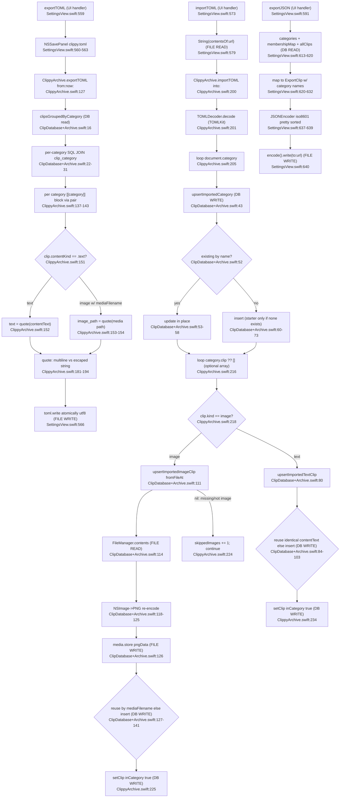

# F6 — Archive Import / Export

TOML round-trip + a separate JSON export. Three UI handlers in `SettingsView`: `exportTOML` ([:559](Sources/Clippy/UI/SettingsView.swift:559)), `importTOML` ([:573](Sources/Clippy/UI/SettingsView.swift:573)), `exportJSON` ([:591](Sources/Clippy/UI/SettingsView.swift:591)).

Asymmetry worth flagging: export hand-assembles TOML by string concatenation (`pair`/`clipPair`/`quote`, [ClippyArchive.swift:181](Sources/Clippy/Storage/ClippyArchive.swift:181)); import uses the real `TOMLKit` parser ([:201](Sources/Clippy/Storage/ClippyArchive.swift:201)). JSON export has no import counterpart and a different shape (clips carry `categories: [String]` instead of nesting).

**Second ingress call-out:** the archive layer is a distinct read+write path over the same clip/category data as F1+F4. Import upserts deliberately bypass the capture pipeline's eviction cap ([ClipDatabase+Archive.swift:78-79](Sources/Clippy/Storage/ClipDatabase+Archive.swift:78)) and create their own clip rows / media files via dedicated `upsertImported*` methods. There are now two independent ways clip/category rows get written, and two ways image media files get written (F1 `media.store` and F6 `upsertImportedImageClip` -> `media.store`).

External deps: TOMLKit (import only), GRDB, AppKit (`NSImage`/`NSBitmapImageRep`, save/open panels), Foundation (`FileManager`, `ISO8601DateFormatter`, `JSONEncoder`), `ClipDatabase.media`.
