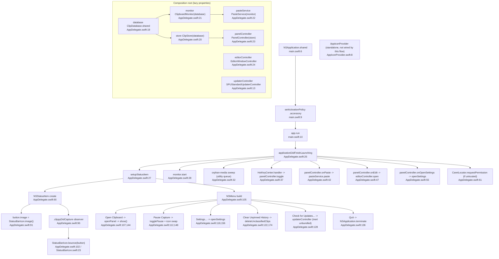

# F7 — App Shell, Menu Bar & Updates

`main.swift:6-10` boots `.accessory` `NSApplication` -> `AppDelegate.applicationDidFinishLaunching` ([:26](Sources/Clippy/AppDelegate.swift:26)) is the single composition root. Subsystems are lazy properties ([:13-24](Sources/Clippy/AppDelegate.swift:13)); decoupling is via closure callbacks, not protocols. Sparkle `SPUStandardUpdaterController` `startingUpdater:` is gated on `SUFeedURL` presence ([:13-14](Sources/Clippy/AppDelegate.swift:13)) — unbundled = inert, "Check for Updates" menu item validates disabled.

`AppIconProvider` is in the file set but has NO inbound edge from this flow; it belongs to clip-card tinting (F2/F5).

This flow wires every other flow:

| Subsystem (flow) | AppDelegate line |
|---|---|
| ClipDatabase (F1/F3/F4/F6) | :19, :33, :183 |
| ClipStore (F2/F4) | :20, :23, :52 |
| ClipboardMonitor (F1) | :21, :28, :149 |
| PasteService (F3) | :22, :45 |
| PanelController (F2) | :23, :38/44/51/56, :145 |
| EditorWindowController (F3) | :24, :51 |
| HotKeyCenter (F2) | :37, :40 |
| CaretLocator (F2) | :61-63 |
| Sparkle updates | :13, :128-133 |
| SettingsView (F5) | :166 |
| StatusBarIcon | :91, :102, :152 |

Side effects: status item creation, menu wiring, icon bounce/swap, pause toggle on monitor, updater check, orphan sweep, `deleteUnclassifiedClips`.
