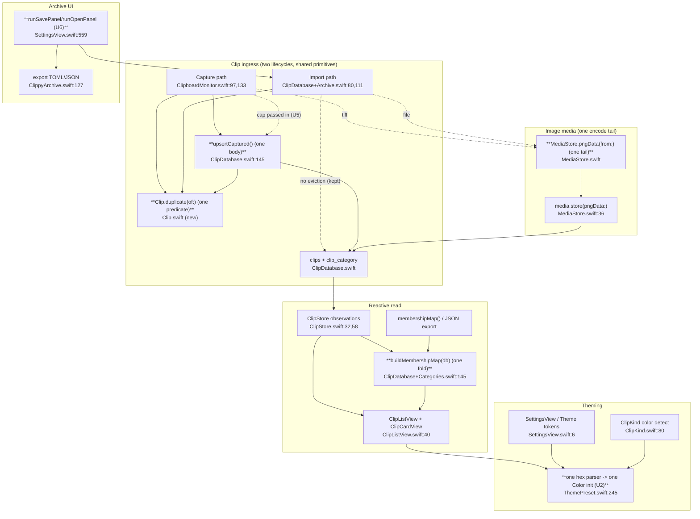

# Unified Proposal — Clippy

Scope: only the ACCIDENTAL duplications from `02-duplication-report.md`. The legitimate-specialization items (L1-L4) are left alone on purpose. Each proposal is the simplest consolidation — one function, one parser, one helper — with no new abstraction layer, no feature flags, no registry/factory, and no divergent behavior preserved "just in case."

Clippy is small (one composition root, ~25 source files). The right move is a handful of extract-and-delegate edits, not a re-architecture.

---

## U1 — One membership-map builder (from D1)

**Consolidated component:** `ClipDatabase.buildMembershipMap(_ db: Database) -> [Int64: Set<Int64>]` — a `static`/instance method taking an open `Database` handle, in [ClipDatabase+Categories.swift](Sources/Clippy/Storage/ClipDatabase+Categories.swift). Single entry point for the fold.

**Old call sites become:**
- `membershipMap()` ([ClipDatabase+Categories.swift:145-150](Sources/Clippy/Storage/ClipDatabase+Categories.swift:145)) -> `dbQueue.read { buildMembershipMap($0) }`.
- ClipStore category observation ([ClipStore.swift:60-64](Sources/Clippy/UI/ClipStore.swift:60)) -> `let membership = ClipDatabase.buildMembershipMap(db)` inside the existing tracking closure (it already has `db`).

**Capability loss:** none. The fold is identical today; this just names it once. Highest value, lowest risk.

---

## U2 — One hex color parser (from D2)

**Consolidated component:** keep `NSColor(themeHex:)` ([ThemePreset.swift:245-270](Sources/Clippy/Support/ThemePreset.swift:245)) as the single parser — it already covers `#RGB`/`#RRGGBB`/`#RRGGBBAA` with alpha. Collapse to ONE `extension Color` initializer that delegates to it.

**Old call sites become:**
- `ClipKind.parseHexColor` ([ClipKind.swift:80-93](Sources/Clippy/Storage/ClipKind.swift:80)) -> delegates to the shared parser (delete the duplicate bit math).
- `Color(hexString:)` ([Theme.swift:279-280](Sources/Clippy/Support/Theme.swift:279)) and `Color(themeHex:fallback:)` ([ThemePreset.swift:232-238](Sources/Clippy/Support/ThemePreset.swift:232)) -> merge into one initializer; call sites in `CategoryEditorView`/`ClipCardView`/`ThemePreset` keep working.

**Capability loss:** none, if the merged initializer preserves the `fallback:` parameter the theme path uses. Watch the CGFloat-vs-Double alpha detail during the merge — that style split is exactly the drift this removes.

---

## U3 — One PNG re-encode helper (from D3)

**Consolidated component:** `MediaStore.pngData(from image: NSImage) -> Data?` (image is the MediaStore's domain), wrapping the `tiffRepresentation -> NSBitmapImageRep -> .png` tail.

**Old call sites become:**
- Capture `pngData(from:)` ([ClipboardMonitor.swift:175-181](Sources/Clippy/Capture/ClipboardMonitor.swift:175)) -> keeps its pasteboard-TIFF front half, calls the shared tail.
- Import re-encode ([ClipDatabase+Archive.swift:117-126](Sources/Clippy/Storage/ClipDatabase+Archive.swift:117)) -> keeps its `NSImage(data:)` front half, calls the shared tail.

**Capability loss:** none. The source-specific front halves stay (live pasteboard vs file on disk are genuinely different inputs); only the identical encode tail is shared. Do NOT also fold in `PasteService`/`AppIconProvider`/thumbnail decoders — those are different concerns (L-class).

---

## U4 — One capture upsert + one shared dedupe predicate (from D4, D5)

**Consolidated component:** private `ClipDatabase.upsertCaptured(_ clip: inout Clip, cap: Int, matchedBy request: QueryInterfaceRequest<Clip>)` holding the bump-or-insert + `evictOverCap` + `media.delete` body once.

**Old call sites become:**
- `saveCapturedClip` ([ClipDatabase.swift:145-165](Sources/Clippy/Storage/ClipDatabase.swift:145)) and `saveCapturedImageClip` ([:170-189](Sources/Clippy/Storage/ClipDatabase.swift:170)) become two-line wrappers that pass the text vs image dedupe request.
- The dedupe predicate (D5) is defined ONCE — e.g. `Clip.duplicate(of:)` returning the right `QueryInterfaceRequest` for text (`contentText` + `contentKind`) or image (`mediaFilename`) — and referenced by both the capture upsert and the import upserts ([ClipDatabase+Archive.swift:85-87,128](Sources/Clippy/Storage/ClipDatabase+Archive.swift:85)).

**Capability loss:** none, and importantly the four ingress methods STAY four methods (L1). Capture bumps timestamp + runs eviction; import preserves rows + skips eviction. Only the byte-identical bump/insert body (capture) and the dedupe predicate (capture + import) are shared. This is the line between the accidental seam and the legitimate lifecycle difference.

---

## U5 — Storage stops reaching the settings singleton (from D6)

**Change:** remove the `cap: Int = AppSettings.shared.maxHistoryItems` default argument from `saveCapturedClip`/`saveCapturedImageClip` ([ClipDatabase.swift:145,170](Sources/Clippy/Storage/ClipDatabase.swift:145)). The caller (`ClipboardMonitor`, which already reads settings) passes `cap` explicitly.

**Capability loss:** none. Restores the injectability the storage layer was refactored for; removes a global reach from inside the persistence layer. Pure decoupling.

---

## U6 — One save/open panel runner (from D7, optional, low priority)

**Consolidated component:** `runSavePanel(name:types:body:) -> String` / `runOpenPanel(types:body:) -> String` private helpers in `SettingsView` that own the panel + `guard runModal() == .OK` + `do/catch -> result string` scaffold.

**Old call sites become:** `exportTOML`/`importTOML`/`exportJSON` ([SettingsView.swift:559,573,591](Sources/Clippy/UI/SettingsView.swift:559)) keep their serialization bodies, lose the scaffold. Ship only if touching this file anyway. D8 (sortOrder/junction one-liners) is below the consolidation bar — skip.

---

## Proposed unified system

Same flows, fewer implementations. New/changed shared components in bold.

**Net effect:** ~5 small extract-and-delegate edits remove every accidental seam (D1-D6), shrink the capture save pair to wrappers, and give image media a single PNG-encode path and color handling a single parser — without merging the genuinely distinct capture/import lifecycles or the trust-specific `Clip(...)` literals.
